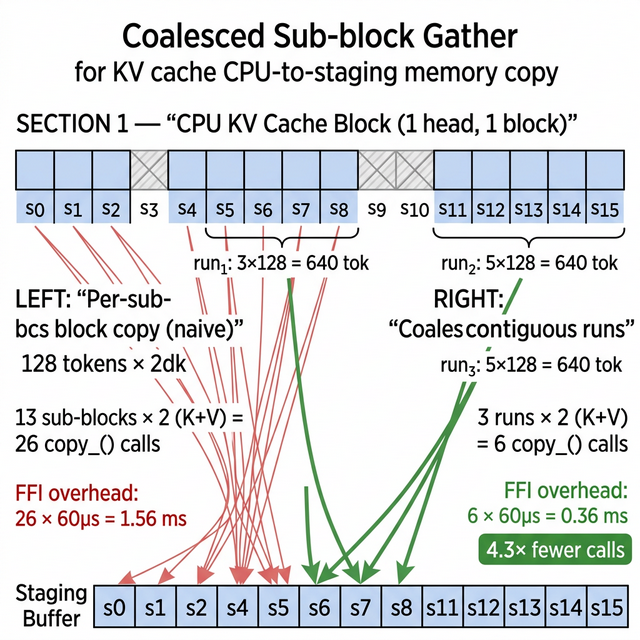

# COMPASS Async Double-Buffered Pipeline

本文档描述 COMPASS `compute_chunked_prefill` 的异步双缓冲 pipeline 设计及合并连续 sub-indices 优化。

## 1. 架构总览


COMPASS 的 per-head 历史块处理 pipeline 包含三个阶段：

| 阶段 | 执行位置 | 操作 |
|------|----------|------|
| **CPU Gather** | CPU (pinned memory) | 从 `k_cache_cpu` 收集 sub-blocks → `staging_k/v_cpu` |
| **H2D Transfer** | PCIe DMA | `staging_cpu` → `k/v_cache_gpu[slot]` (async) |
| **BLASST Compute** | GPU compute_stream | 动态稀疏注意力计算 |

### 双缓冲设计

使用 **2 个 GPU ring slots (slot 0, slot 1)** 交替：

```
Batch 0: gather → H2D → slot A ─── BLASST(slot A)
Batch 1: gather → H2D → slot B ──────── BLASST(slot B)
Batch 2: gather → H2D → slot A ─────────── BLASST(slot A)
                                                    └── sync once per head
```

**关键**：`compute_stream.synchronize()` 从每个 batch 移到每个 head 结束后只调一次。

## 2. 同步模型

### 三个约束

1. **Staging Buffer 安全**：共享的 staging buffer 只有一份，必须等前一次 H2D 读完 staging 后才能开始下一次 gather 覆写。
   ```python
   if batch_idx > 0:
       offload_engine.slot_transfer_streams[prev_slot].synchronize()
   ```

2. **Slot 复用安全**：`load_staging_to_slot(slot)` 内部 wait `ring_slot_compute_done[slot]`，确保该 slot 的前一次 BLASST 已完成。

3. **m_global 依赖**：所有 BLASST 调用在同一个 `compute_stream` 上，stream ordering 自动保证前一个 BLASST 的 `m_global` 输出对下一个可见。

### 事件记录

`compute_done` 事件必须在 **compute_stream** 上 record（而非 default stream）：
```python
with torch.cuda.stream(compute_stream):
    blasst_chunked_prefill(...)
    offload_engine.ring_slot_compute_done[curr_slot].record(compute_stream)
```

## 3. 合并连续 Sub-Indices 优化

### 问题



`gather_subblocks_per_head` 原始实现对每个 128-token sub-block 单独调用 `copy_()`：

- 32 subs × 2 (K+V) = **64 次 PyTorch FFI 调用**
- 每次仅 32KB，但 FFI 开销 ~60μs/call
- 总开销: 64 × 60μs ≈ **3.84ms**（实测 4.08ms）

### 解决方案

检测连续 sub-indices，合并为单次大 copy：

```python
# [0,1,2,...,31] → 1 run of length 32 → 1 copy of 4096 tokens
# [0,1,2,5,6,7]  → 2 runs: [(0,3), (5,3)] → 2 copies
i = 0
while i < len(sub_indices):
    run_start = sub_indices[i]
    run_len = 1
    while (i + run_len < len(sub_indices)
           and sub_indices[i + run_len] == run_start + run_len):
        run_len += 1
    n_tok = run_len * sub_block_size
    staging_k[dst:dst+n_tok, h, :].copy_(cache[..., src:src+n_tok, h, :])
    i += run_len
```

top_p=0.9 时 ~90% sub-blocks 被选中，大多数完全连续 → **64 → 2 次 copy → ~32× 加速**。

## 4. 性能结果

32K context, niah_single_1, Llama-3.1-8B-Instruct, RTX 3090:

| 指标 | 原始 (serial) | +async pipeline | +coalesced gather | 总提升 |
|------|--------------|----------------|-------------------|--------|
| `compute_chunked_prefill` | 53.3s | 42.6s (−20%) | **27.0s** | **−49%** |
| 总 prefill | 57.6s | 46.6s (−19%) | **30.4s** | **−47%** |
| E2E | 85.6s | 71.4s (−17%) | **52.2s** | **−39%** |
| 准确率 | 100% | 100% | **100%** | — |

### nsys 指标对比

| CUDA API | 原始 | 最终 |
|----------|------|------|
| `cudaStreamSynchronize` | 34.1s (40.4%) | ~15s |
| `cudaMemcpyAsync` | 20.0s | ~19s |
| `cudaEventRecordWithFlags` | 387ms | ~250ms |

## 5. 相关文件

| 文件 | 说明 |
|------|------|
| [`compass.py`](../nanovllm/kvcache/sparse/compass.py) | 双缓冲 pipeline 主逻辑 (L510-L600) |
| [`offload_engine.py`](../nanovllm/kvcache/offload_engine.py) | 合并连续 gather (L875-L897) |
| [`results/nsys/compass/`](../results/nsys/compass/) | nsys profile 文件 |

## 6. NVTX 标记

代码中包含 NVTX 标记，用于 nsys GUI 中识别各操作：

| 颜色 | 操作 | 标签格式 |
|------|------|---------|
| 🟡 黄色 | staging sync | `COMPASS L{l} H{h} B{b}/{n}: staging_sync slot{s}` |
| 🟠 橙色 | CPU gather | `COMPASS L{l} H{h} B{b}/{n}: CPU gather {subs}subs {tok}tok` |
| 🟢 绿色 | H2D transfer | `COMPASS L{l} H{h} B{b}/{n}: H2D staging→slot{s} {tok}tok` |
| 🔵 蓝色 | BLASST compute | `COMPASS L{l} H{h} B{b}/{n}: BLASST {tok}tok slot{s}` |
| 🟣 紫色 | merge | `COMPASS L{l} H{h} B{b}/{n}: merge` |
| 🔷 青色 | current chunk | `COMPASS L{l}: current_chunk_causal {tok}tok` |
