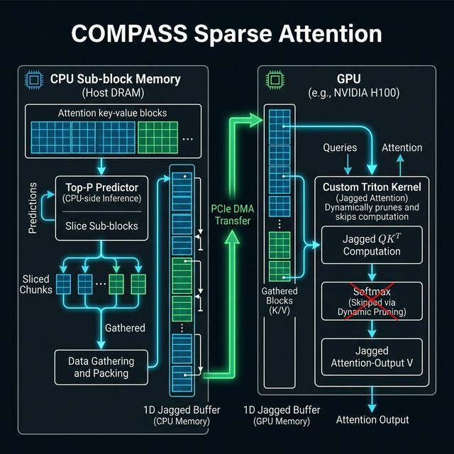

# COMPASS V2 Jagged Memory Architecture

This document explains the V2 architecture of the COMPASS sparse attention policy, specifically addressing the transition to jagged 1D memory buffers and customized Triton kernels.

## The Core Problem Addressed
In V1 of the COMPASS pipeline, selected sub-blocks from the CPU were transferred to fixed-size "Ring Slots" on the GPU. This forced the system to pad or slice data sequentially, leading to tensor size mismatches (`RuntimeError: The size of tensor a must match...`) and inefficient memory allocation across attention heads, as each head dynamically selects a varying number of tokens (creating a "jagged" shape).

## V2 Architecture: 4-Step Pipeline

The V2 Jagged Pipeline implements the following 4 core steps:

### 1. CPU Top-P Coarse Screening (Top-P Predictor)
All historical KV Cache data is stored globally in the CPU's pinned memory. Whenever a new Attention query arrives during the chunked prefill phase, the CPU's Top-P predictor computes the inner product between quantized queries and the available historical keys. Based on a dynamic probability curve, it selects the most important sub-blocks uniquely for **each Attention head**.

### 2. Data Gathering and 1D Jagged Packing
Because each head selects a different number of tokens, the required blocks form a jagged shape. The CPU takes these scattered sub-blocks and tightly "squeezes" them together head-by-head into a massive contiguous 1D array called the **CPU Jagged Staging Buffer** (`offload_engine.jagged_staging_*`).
* This step eliminates all padding.
* A lightweight offset array (`kv_indptr`) is simultaneously generated to record exactly where each head's data begins and ends within the 1D buffer.

### 3. Asynchronous PCIe Bulk DMA Transfer
With the data compacted perfectly into a 1D array, the system initiates a single asynchronous PCIe DMA command (`load_packed_staging_to_jagged_gpu`) to blast the packed buffer to pre-allocated global 1D buffers on the GPU (`jagged_k_gpu`, `jagged_v_gpu`). 
* This provides a massive throughput boost by maximizing the PCIe payload and removing the overhead of copying multiple disjoint small blocks.

### 4. GPU Custom Jagged Triton Kernel (`_compass_jagged_fwd`)
Once the 1D data arrives on the GPU, there is **no unpacking layer**. Reconstructing the original padded shape would waste GPU SRAM and memory bandwidth.
Instead, we introduced a highly specialized Triton Kernel:
*   It inherently understands the 1D flattened format using the `kv_indptr` tensor.
*   It computes block-sparse attention directly on the packed flat memory using the offsets to map threads to the appropriate tokens.
*   It concurrently performs dynamic LSE pruning (BLASST Skip Softmax logic) directly inside the kernel, skipping unnecessary exponentials to yield extreme performance acceleration.

## Summary of Refactors
*   `nanovllm/kvcache/offload_engine.py`: Replaced `gather_subblocks_per_head` with `gather_packed_subblocks_all_heads`. Replaced per-slot staging with single globals (`jagged_staging_k/v`).
*   `nanovllm/kvcache/sparse/compass.py`: Removed batch loop dimension and cross-head zero-padding overrides.
*   `nanovllm/ops/compass.py`: Introduced the new Triton primitive capable of computing var-len queries and jagged keys simultaneously.
